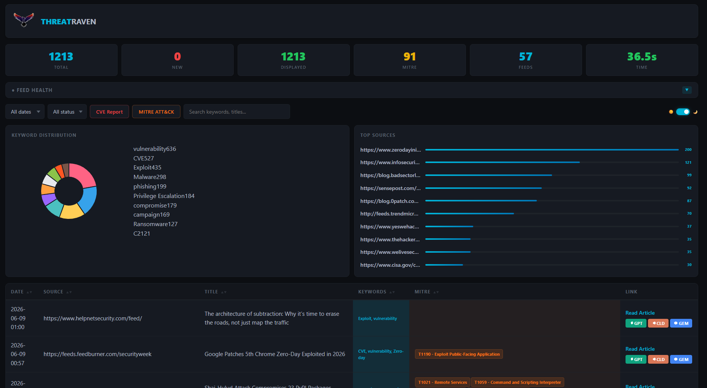

# ThreatRaven

APT Intelligence Feed Monitor — fetches, matches, and reports on threat intelligence from 57+ cybersecurity RSS feeds.



## What it does

ThreatRaven monitors RSS/Atom feeds from security vendors, research labs, and threat intel sources. It matches incoming articles against configurable keywords and MITRE ATT&CK techniques, then generates an interactive HTML dashboard and CSV export.

**Core capabilities:**
- Parallel feed fetching with retry logic and rate limiting
- Keyword and MITRE ATT&CK technique matching
- Interactive HTML report with charts, sorting, filtering, and dark/light theme
- CSV export for SIEM integration or further analysis
- Feed health monitoring with success/failure tracking
- Deduplication across runs via previous CSV comparison
- NVD CVE vulnerability lookup (last 30 days, configurable)

## Quick start

```powershell
.\ThreatRaven.ps1
```

Opens the HTML report automatically. That's it.

## Parameters

| Parameter | Description |
|---|---|
| `-ConfigPath` | Path to custom `config.json` (default: script directory) |
| `-PreviousCsvPath` | Previous CSV for deduplication |
| `-SkipDeduplication` | Skip loading previous CSV |
| `-OutputDir` | Output directory (default: script directory) |
| `-ExportHealthReport` | Export feed health to JSON |
| `-NonInteractive` | Skip all prompts (CI/CD mode) |
| `-NoOpenReport` | Don't auto-open HTML report |
| `-QuietMode` | Suppress console output |

## Examples

```powershell
# Basic run
.\ThreatRaven.ps1

# CI/CD mode — no prompts, no browser, export health report
.\ThreatRaven.ps1 -NonInteractive -NoOpenReport -ExportHealthReport

# Deduplicate against previous run
.\ThreatRaven.ps1 -PreviousCsvPath ".\reports\last_run.csv"

# Custom config and output
.\ThreatRaven.ps1 -ConfigPath "C:\Config\intel.json" -OutputDir "C:\Reports"
```

## Configuration

Edit `config.json` to customize:

- **Keywords** — terms to match in article titles/descriptions
- **MITRE ATT&CK** — technique IDs and names to detect
- **Feeds** — RSS/Atom URLs to monitor
- **Settings** — throttle limits, timeouts, retry counts, CVE lookup window

## Output

| File | Description |
|---|---|
| `APT_Report_YYYY-MM-DD_HH-MM.html` | Interactive dashboard |
| `APT_Report_YYYY-MM-DD_HH-MM.csv` | Raw data export |
| `RunConfig_YYYY-MM-DD_HH-MM.json` | Config snapshot for this run |
| `logs/ThreatFeed_YYYY-MM-DD_HH-MM.log` | Detailed execution log |

## HTML Report Features

- Doughnut chart for keyword distribution
- Top sources bar chart
- Sortable data table with search
- Dark/light theme toggle
- Feed health panel with status indicators
- MITRE ATT&CK technique drill-down
- CVE vulnerability report (NVD integration)
- AI analysis buttons (ChatGPT, Claude, Gemini)
- Print-optimized CSS

## Requirements

- PowerShell 5.1+ (Windows PowerShell or PowerShell Core)
- No external modules required
- Internet access for feed fetching and CVE lookups

## Project structure

```
ThreatRaven/
├── ThreatRaven.ps1        # Main script
├── FeedHelpers.psm1       # Shared module (parsing, config, logging)
├── config.json            # Keywords, MITRE techniques, feeds, settings
├── assets/
│   └── logo.png           # Project logo
├── lib/
│   └── chart.min.js       # Chart.js (local, no CDN)
└── logs/                  # Created at runtime
```

## License

MIT

## Author

**Diyar Abbas** 
